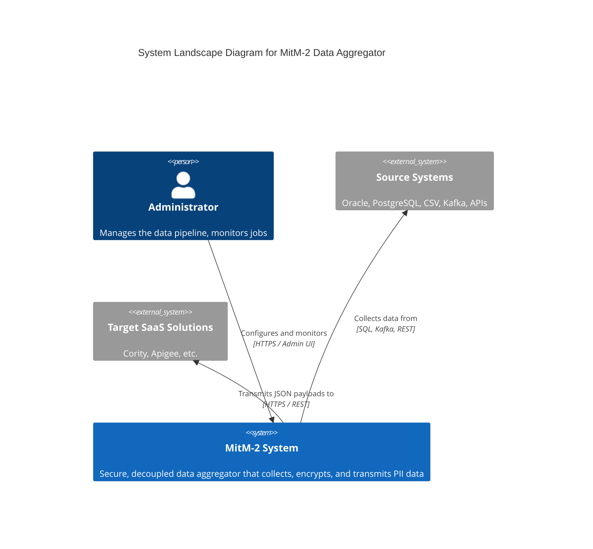

# MitM-2 Core Layer

This repository contains the newly ported, Rust-based **core-layer** microservices for the MitM-2 Data Aggregator system. It serves as a drop-in replacement for the legacy Go architecture, providing memory safety, high concurrency via Tokio, and robust cryptographic abstractions.

## Architecture

The system is composed of strongly decoupled microservices communicating via JSON messages over Unix Domain Sockets (UDS). The central communication hub is the PostgreSQL database, managed efficiently via `sqlx` connection pools.

### C4 System Landscape Diagram



## Components

The workspace is split into the following crates. Please consult the individual `README.md` and `CHANGELOG.md` files in each component directory for detailed documentation, configuration options, and version histories:

- [**mitm_common**](./mitm_common): Shared types, IPC payloads, and configuration loader.
- [**mitm_http-server**](./mitm_http-server): The Axum-based API Gateway (REST JSON:API).
- [**mitm_iam-server**](./mitm_iam-server): The Identity and Access Management server handling AES-256-GCM envelope encryption and RBAC.
- [**mitm_scheduler-server**](./mitm_scheduler-server): The job orchestration engine tracking system PIDs and executing jobs.

## Configuration Architecture

The MitM-2 core layer follows a **decentralized, stateless configuration model** for its primary microservices, adhering to the 12-Factor App methodology.

- **Independent Loading**: The HTTP, IAM, and Scheduler servers _each_ independently load their configuration upon startup using `mitm_common::config::load_config()`.
- **Resilience**: This guarantees that if a single service crashes, the supervisor can restart it instantly without it hanging or waiting for a master process to push the configuration via IPC.
- **Reference**: An unencrypted example configuration structure can be found at [`config/example_config.json`](./config/example_config.json). In production, this JSON is encrypted into a `.enc` file using AES-256-GCM, and is decrypted at runtime using the `MASTER_KEY` environment variable.

## Build Instructions

You can build all core components as statically linked binaries using Cargo workspaces:

```bash
cargo build --workspace --release
```

Or run the specific legacy build script if you need Musl targets:

```bash
./build.sh
```

## Docker Deployment (Example)

To deploy the system in an isolated container environment, you can use the following example `Dockerfile` and startup sequence. It uses a lightweight Alpine image and supervisord to run all binaries.

### `Dockerfile`

```dockerfile
# Build Stage
FROM rust:1.80-alpine AS builder
RUN apk add --no-cache musl-dev
WORKDIR /usr/src/mitm-core
COPY . .
RUN cargo build --workspace --release

# Runtime Stage
FROM alpine:3.19
RUN apk add --no-cache supervisor
WORKDIR /app

# Copy binaries
COPY --from=builder /usr/src/mitm-core/target/release/mitm-iam-server /app/
COPY --from=builder /usr/src/mitm-core/target/release/mitm-scheduler-server /app/
COPY --from=builder /usr/src/mitm-core/target/release/mitm-http-server /app/

# Setup Supervisor
COPY supervisord.conf /etc/supervisord.conf

# Set required environment variables (in production, use Docker secrets / .env files)

EXPOSE 8080
CMD ["/usr/bin/supervisord", "-c", "/etc/supervisord.conf"]
```

### Startup Sequence (`supervisord.conf`)

Since the HTTP Server and Scheduler Server depend on the IAM Server (for cryptographic keys and RBAC) and the Database, the startup sequence should prioritize the IAM daemon:

```ini
[supervisord]
nodaemon=true

[program:iam-server]
command=/app/mitm-iam-server
autostart=true
autorestart=true
priority=10

[program:scheduler-server]
command=/app/mitm-scheduler-server
autostart=true
autorestart=true
priority=20

[program:http-server]
command=/app/mitm-http-server
autostart=true
autorestart=true
priority=30
```

## SpecDD Compliance

This layer strictly adheres to the SpecDD (Specification-Driven Development) framework defined for the MitM-2 project. All features, architecture constraints, and security standards (e.g., envelope encryption) are maintained.
