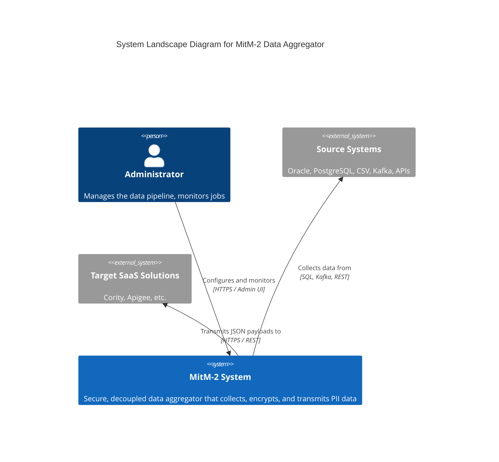

# MitM-2 Core Layer (Rust)

This repository contains the newly ported, Rust-based **core-layer** microservices for the MitM-2 Data Aggregator system. It serves as a drop-in replacement for the legacy Go architecture, providing memory safety, high concurrency via Tokio, and robust cryptographic abstractions.

## Architecture

The system is composed of strongly decoupled microservices communicating via JSON messages over Unix Domain Sockets (UDS). The central communication hub is the PostgreSQL database, managed efficiently via `sqlx` connection pools.

### C4 System Landscape Diagram



## Components

The workspace is split into the following crates. Please consult the individual `README.md` and `CHANGELOG.md` files in each component directory for detailed documentation, configuration options, and version histories:

- [**mitm_common**](./mitm_common): Shared types, IPC payloads, and configuration loader.
- [**mitm_http-server**](./mitm_http-server): The Axum-based API Gateway (REST JSON:API).
- [**mitm_iam-server**](./mitm_iam-server): The Identity and Access Management server handling AES-256-GCM envelope encryption and RBAC.
- [**mitm_scheduler-server**](./mitm_scheduler-server): The job orchestration engine tracking system PIDs and executing jobs.

## Build Instructions

You can build all core components as statically linked binaries using Cargo workspaces:

```bash
cargo build --workspace --release
```

Or run the specific legacy build script if you need Musl targets:
```bash
./build.sh
```

## SpecDD Compliance

This layer strictly adheres to the SpecDD (Specification-Driven Development) framework defined for the MitM-2 project. All features, architecture constraints, and security standards (e.g., envelope encryption) are maintained.
