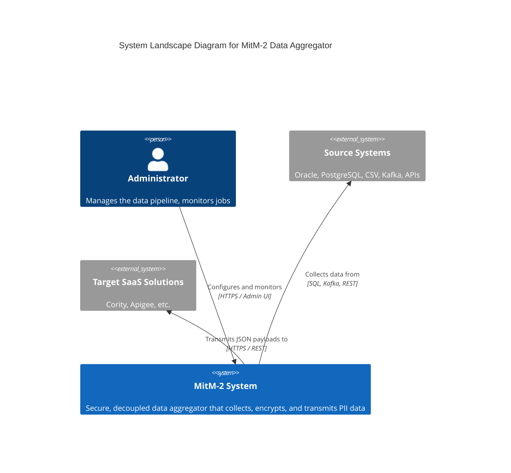
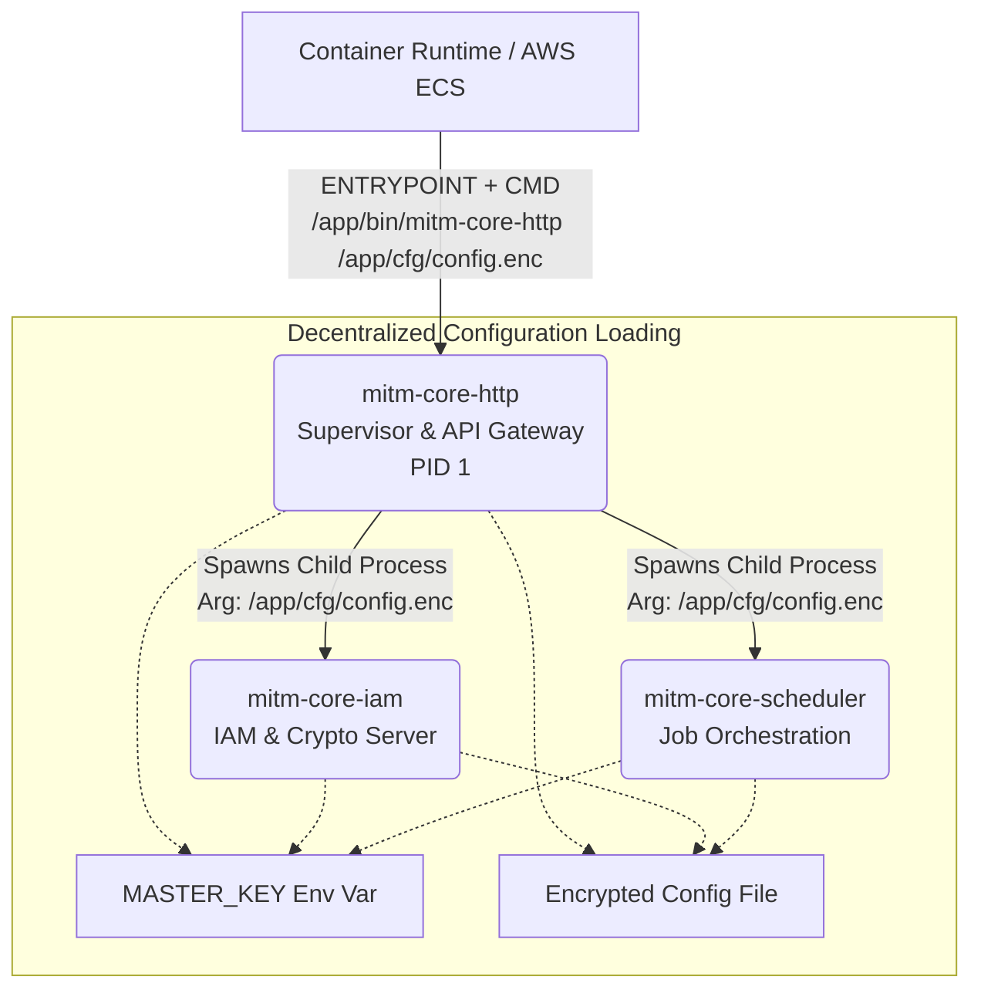

# MitM-2 Core Layer

This repository contains the newly ported, Rust-based **core-layer** microservices for the MitM-2 Data Aggregator system. It serves as a drop-in replacement for the legacy Go architecture, providing memory safety, high concurrency via Tokio, and robust cryptographic abstractions.

## Architecture

The system is composed of strongly decoupled microservices communicating via JSON messages over Unix Domain Sockets (UDS). The central communication hub is the PostgreSQL database, managed efficiently via `sqlx` connection pools.

### C4 System Landscape Diagram



## Components

The workspace is split into the following crates. Please consult the individual `README.md` and `CHANGELOG.md` files in each component directory for detailed documentation, configuration options, and version histories:

- [**mitm_common**](./mitm_common): Shared types, IPC payloads, and configuration loader.
- [**mitm_http-server**](./mitm_http-server): The Axum-based API Gateway (REST JSON:API).
- [**mitm_iam-server**](./mitm_iam-server): The Identity and Access Management server handling AES-256-GCM envelope encryption and RBAC.
- [**mitm_scheduler-server**](./mitm_scheduler-server): The job orchestration engine tracking system PIDs and executing jobs.

## Configuration Architecture

The MitM-2 core layer follows a **decentralized, stateless configuration model** for its primary microservices, adhering to the 12-Factor App methodology.

- **Independent Loading**: The HTTP, IAM, and Scheduler servers _each_ independently load their configuration upon startup using `mitm_common::config::load_config()`.
- **Resilience**: This guarantees that if a single service crashes, the supervisor can restart it instantly without it hanging or waiting for a master process to push the configuration via IPC.
- **Reference**: An unencrypted example configuration structure can be found at [`config/example_config.json`](./config/example_config.json). In production, this JSON is encrypted into a `.enc` file using AES-256-GCM, and is decrypted at runtime using the `MASTER_KEY` environment variable.

### Environment Variable Configuration (12-Factor App)

Alternatively, you can fully configure the core components using Environment Variables instead of an encrypted `config.json`. The application automatically switches to ENV mode if the `MITM_DB_HOST` variable is set.

**Available Environment Variables:**
- `MITM_DB_HOST` (String) - Trigger for ENV mode. PostgreSQL Database Host.
- `MITM_DB_PORT` (Integer) - PostgreSQL Port (Default: 5432)
- `MITM_DB_USER` (String) - DB Username
- `MITM_DB_PASSWORD` (String) - DB Password
- `MITM_DB_NAME` (String) - DB Name
- `MITM_DB_SSLMODE` / `MITM_DB_SSL` (String/Bool) - e.g. `require`, `disable` (Default: true)
- `MITM_DB_MAX_CONNS` (Integer) - Max pool connections (Default: 50)
- `MITM_DB_CONNECT_DELAY` (Integer) - Retry delay in seconds (Default: 5)
- `MITM_LOG_LEVEL` (String) - e.g. `INFO`, `DEBUG` (Default: INFO)
- `MITM_HTTP_PORT` (Integer) - Webserver port (Default: 8443)
- `MITM_USE_HTTPS` (Bool) - `true` or `false` (Default: true)
- `MITM_SSL_CERT` / `MITM_SSL_CRT` (String) - Path to TLS certificate
- `MITM_SSL_KEY` (String) - Path to TLS private key
- `MITM_UPLOAD_DIR` (String) - Path for file uploads
- `MITM_SOCKET_DIR` (String) - Path for IPC UDS sockets
- `MITM_ADMINS` (String) - Comma-separated list of initial admin usernames

**Example (docker-compose.yml / ECS Task Definition):**
```yaml
environment:
  - MASTER_KEY=my-super-secret-key
  - MITM_DB_HOST=postgres.internal.net
  - MITM_DB_PORT=5432
  - MITM_DB_USER=mitm_admin
  - MITM_DB_PASSWORD=secret_db_pass
  - MITM_DB_NAME=mitm_db
  - MITM_HTTP_PORT=8080
  - MITM_USE_HTTPS=false
  - MITM_LOG_LEVEL=DEBUG
```

## Build Instructions

You can build all core components as statically linked binaries using Cargo workspaces:

```bash
cargo build --workspace --release
```

Or run the specific legacy build script if you need Musl targets:

```bash
./build.sh
```

## Process Orchestration (Supervisor Pattern)

The core layer utilizes an embedded supervisor architecture, entirely removing the need for external tools like `supervisord` or `s6-overlay`. When deployed (e.g., via Docker to AWS ECS), the HTTP server acts as the central Orchestrator (PID 1).

### Startup Sequence & Architecture



1. **Initialization:** The container runtime starts `mitm-core-http` as PID 1, passing the path to the configuration file via CLI arguments (e.g., `/app/cfg/config.enc`).
2. **Process Spawning:** The HTTP server locates the `mitm-core-iam` and `mitm-core-scheduler` binaries in its local directory and spawns them as child processes, passing the exact same configuration parameter to both.
3. **Decentralized Loading:** All three processes independently read the `MASTER_KEY` environment variable and use it to decrypt the shared configuration file at the provided path.
4. **Fail-Fast Monitoring:** The HTTP server actively monitors the health of its child processes. If either the IAM or Scheduler process crashes, the HTTP server catches the exit status, forcefully terminates the remaining process, and shuts itself down with an error code (Exit 1). This ensures the container orchestrator (like AWS ECS) correctly flags the container as unhealthy and replaces it immediately.

## SpecDD Compliance

This layer strictly adheres to the SpecDD (Specification-Driven Development) framework defined for the MitM-2 project. All features, architecture constraints, and security standards (e.g., envelope encryption) are maintained.
