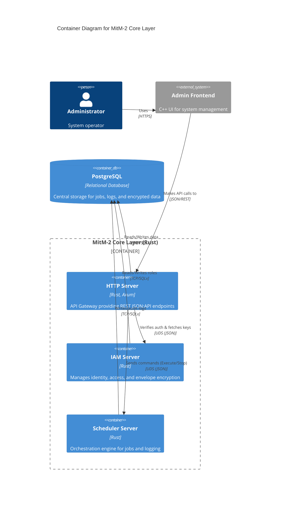

# MitM-2 Core Layer

This repository contains the core components of the MitM-2 Data Aggregator architecture. The core has been completely ported to a modular Rust microservices architecture.

## Components

- **`mitm_common`**: Shared libraries, crypto functions, database configurations, and standard IPC structures.
- **`mitm_http-server`**: The central API gateway (Admin API). It provides the REST API for the C++ Frontend and other external consumers. Implemented using `axum` and `sqlx`, offering fully paginated JSON:API endpoints for Job Management, DLQ, and RBAC.
- **`mitm_iam-server`**: The Identity and Access Management service. Runs as a background daemon connected via Unix Domain Sockets (UDS), managing envelope encryption for user roles, keys, and master-key derivation (Argon2id).
- **`mitm_scheduler-server`**: The orchestration engine. Handles chron-jobs, prevents concurrent executions, and writes system/audit logs to the database. Listens for `ExecuteJob`, `StopJob`, and `UpdateJobs` commands via IPC.

## Architecture

All microservices communicate via JSON messages over Unix Domain Sockets (UDS). The central communication hub is the PostgreSQL database, managed efficiently via `sqlx` connection pools.

### C4 Container Diagram



- **Security**: The `MASTER_KEY` is provided at startup via environment variables and is never persisted. PII data and roles are protected using AES-256-GCM envelope encryption.
- **API Standard**: The `mitm_http-server` strictly adheres to the JSON:API specification for all error messages and data structures.

## Build

You can build all core components as statically linked binaries using the provided build script:

```bash
./build.sh
```

The script uses the `x86_64-unknown-linux-musl` target and drops the compiled binaries into the `../bin/` directory.
