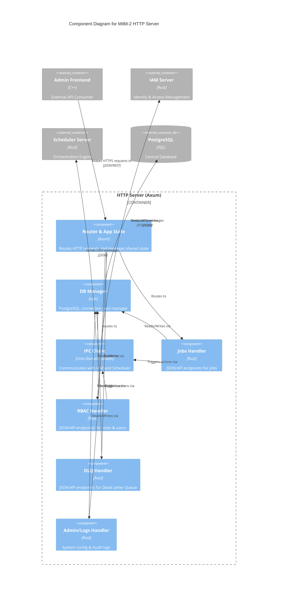

# mitm_http-server

The HTTP Server acts as the API Gateway for the MitM-2 architecture. It provides a RESTful interface adhering to the JSON:API standard, serving external consumers like the C++ Admin Frontend.

## Architecture & Components

The server is built on **Axum** and uses **sqlx** for asynchronous PostgreSQL access. It communicates with other internal microservices via Unix Domain Sockets (UDS).

### C4 Component Diagram



## Configuration

- `MITM_DB_URL` (optional): PostgreSQL Connection String.
- `IAM_SOCKET_PATH` (optional): Path to the IAM UDS.
- `SCHEDULER_SOCKET_PATH` (optional): Path to the Scheduler UDS.

## Execution

```bash
cargo run -p mitm-http-server
```
