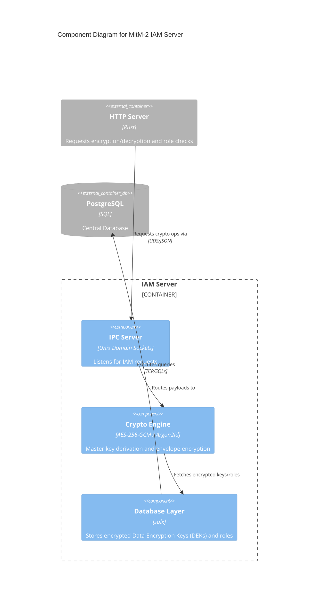

# mitm_iam-server

The IAM Server (Identity and Access Management) manages envelope encryption for user roles, cryptographic keys, and master-key derivation using Argon2id. It runs as a background daemon connected via Unix Domain Sockets (UDS).

## Architecture & Components

**Security Note**: The `MASTER_KEY` is provided at startup via environment variables and is never persisted. PII data and roles are protected using AES-256-GCM envelope encryption.

### C4 Component Diagram



## Configuration

The IAM Server expects the following environment variables:

- `MITM_DB_URL` (optional): PostgreSQL Connection String. Overrides the `.enc` config.
- `MASTER_KEY` (required): The cryptographic master key for AES-GCM envelope encryption. Must be provided at startup via ENV and is never persisted.
- `IAM_SOCKET_PATH` (optional): Override the Unix Domain Socket path (defaults to `/tmp/mitm_iam.sock`).

## Execution

Run the server directly (ensure PostgreSQL is running):
```bash
MASTER_KEY="your-secure-key" cargo run -p mitm-iam-server
```
