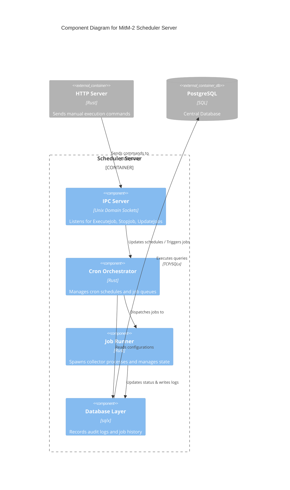

# mitm_scheduler-server

The Scheduler Server is the orchestration engine of the MitM-2 system. It manages cron-jobs, ensures that jobs do not run concurrently, spawns the respective collector/delivery processes, and writes centralized system and audit logs.

## Architecture & Components

### C4 Component Diagram



## Configuration

The Scheduler Server relies on the following environment variables:

- `MITM_DB_URL` (optional): PostgreSQL Connection String. Overrides the `.enc` config.
- `MASTER_KEY` (required): Passed via IPC to the HTTP Server during startup handshakes if needed, though primarily managed by IAM.
- `SCHEDULER_SOCKET_PATH` (optional): Override the Unix Domain Socket path (defaults to `/tmp/mitm_scheduler.sock`).

## Execution

```bash
cargo run -p mitm-scheduler-server
```
